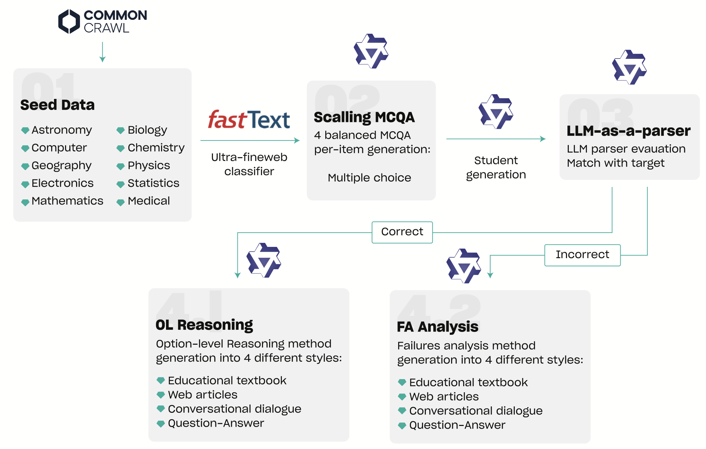

<p align="center">
  
  
  
  
  
</p>

<h1 align="center">QVAC Genesis III</h1>

<div align="center">
  <b>A Large-Scale, High-Quality Open Synthetic STEM Corpus for Efficient Language Model Pre-Training</b>
</div>

<p align="center">
  <a href="#-genesis-research-program">🌱 Genesis research program</a> •
  <a href="#-research-checkpoints">🧪 Research checkpoints</a> •
  <a href="#-evaluation-generation-first-llm-as-a-parser">📊 Evaluation</a> •
  <a href="#quick-start">Quick start</a> •
  <a href="#-citation">📖 Citation</a> •
  <a href="#-license">⚖️ License</a>
</p>

<p align="center">
  
</p>

<div align="center">
  <i>Genesis III dual-method synthetic data generation pipeline. Seed passages
are quality-filtered, converted into MCQs, answered by a student model, and parsed via
LLM-as-a-parser extraction. Correct answers are routed to Option-Level (OL) Reasoning;
incorrect or non-extractable answers are routed to Failure Analysis (FA)</i>
</div>

---

QVAC Genesis III is a 191.43B-token synthetic STEM corpus built from two
complementary educational data-generation methods: Failure Analysis (FA) and
Option-Level Reasoning (OL). The accompanying work was accepted at [COLM 2026](https://arxiv.org/abs/2609.19513).

| Resource | Link |
| -------- | ---- |
| 📄 Paper (COLM 2026) | [arXiv:2609.19513](https://arxiv.org/abs/2609.19513) |
| 💻 Code | [github.com/tether-ai-research/qvac-genesis-III](https://github.com/tether-ai-research/qvac-genesis-III) |
| 🤗 Hugging Face collection | [huggingface.co/collections/qvac/genesis-iii](https://huggingface.co/collections/qvac/genesis-iii) |
| 🗃️ Dataset | [huggingface.co/datasets/qvac/GenesisIII](https://huggingface.co/datasets/qvac/GenesisIII) |


## 🌱 Genesis research program

| Release | Date | Milestone | Link |
| ------- | ---- | --------- | ---- |
| 🌱 Genesis I | October 2025 | Introduced Learning from Failures | [HF blog](https://huggingface.co/blog/qvac/genesis-i) |
| 🌿 Genesis II | December 2025 | Introduced Option-Level Reasoning | [HF blog](https://huggingface.co/blog/qvac/genesis-ii) |
| 🌳 Genesis III | September 2026 | Combines both methods at larger scale, evaluated through controlled from-scratch pre-training experiments | [HF blog](https://huggingface.co/blog/qvac/genesis-iii) |

## 🧪 Research checkpoints

The released checkpoints are the controlled ablations from the paper:

| Checkpoint | Role | Hugging Face |
| ---------- | ---- | ------------ |
| 🔍 Failure Analysis | FA data ablation | [qvac-genesis-iii-qwen3-1.7b-fa](https://huggingface.co/qvac/qvac-genesis-iii-qwen3-1.7b-fa) |
| 🧠 Option-Level | OL data ablation | [qvac-genesis-iii-qwen3-1.7b-ol](https://huggingface.co/qvac/qvac-genesis-iii-qwen3-1.7b-ol) |
| 🔗 Combined FA+OL | Full Genesis III mix | [qvac-genesis-iii-qwen3-1.7b-combined](https://huggingface.co/qvac/qvac-genesis-iii-qwen3-1.7b-combined) |

All checkpoints are research artifacts for studying pre-training data, not
instruction-tuned assistants or general-purpose production models.

The combined Genesis III corpus versus the token-matched controlled
Cosmopedia-v2 baseline (7 epochs), with the public Cosmo-1B as an
uncontrolled reference:


Additional ablations: [Option-Level versus Failure
Analysis](assets/genesis_split_ablation.png) and [cross-architecture
transfer](assets/genesis_cross_architecture.png).

## 📊 Evaluation: generation-first, LLM-as-a-parser

Genesis III checkpoints are evaluated with a generation-first protocol, which
is part of the paper's methodology. Rather than scoring answer choices by
log-likelihood, each checkpoint generates a free-form response, and a judge
model — CompassJudger-2-32B — parses a single final answer from the generated
text. The parsed answer is then scored against the gold label:


The [`evaluation`](evaluation) directory contains our complete implementation
of this protocol: official OpenCompass plus a small local extension, covering
ARC-Easy, ARC-Challenge, GPQA Diamond, and 19 MMLU STEM domains. Candidate
generation is greedy; the parser runs at temperature 0.01. The shipped
`config.yaml` is an annotated sample that evaluates one Genesis III
checkpoint — edit it to evaluate any Hugging Face model or local checkpoint.

## Quick start

```bash
cd evaluation
./setup.sh --backend vllm
./run.sh --backend vllm
```

### Optional SLURM wrapper

The runner does not require SLURM. Run it directly on a GPU machine or inside
an existing allocation. A thin optional wrapper is included:

```bash
sbatch --partition=<gpu-partition> run.sbatch --backend vllm
```

### Transformers backend

Transformers can replace vLLM for both candidate generation and judging:

```bash
./setup.sh --backend transformers
./run.sh --backend transformers
```

See [`evaluation/README.md`](evaluation/README.md) for resource requirements,
smoke tests, output files, and configuration details.

## 📖 Citation

If you use Genesis III in your research, please cite:

```bibtex
@misc{vitabile2026qvacgenesisiii,
  title         = {QVAC Genesis III: A Large-Scale, High-Quality Open Synthetic STEM Corpus for Efficient Language Model Pre-Training},
  author        = {Davide Vitabile and Nikhil Ranjan and Akshay Nambiar and Kamal Kumar Gupta and Amril Nazir},
  year          = {2026},
  eprint        = {2609.19513},
  archivePrefix = {arXiv},
  primaryClass  = {cs.AI},
  institution   = {Tether Data, S.A. de C.V. d.b.a. Tether AI Research},
  note          = {Accepted at the Conference on Language Modeling (COLM) 2026},
  url           = {https://arxiv.org/abs/2609.19513}
}
```

## ⚖️ License

Code and data are licensed separately.

| What | Where | License |
| ---- | ----- | ------- |
| This repository, including the evaluation suite | [LICENSE](LICENSE) | [Apache-2.0](https://www.apache.org/licenses/LICENSE-2.0) |
| Genesis III dataset | [qvac/GenesisIII](https://huggingface.co/datasets/qvac/GenesisIII) | [CC BY-NC 4.0](https://creativecommons.org/licenses/by-nc/4.0/) |

Apache-2.0 applies to the code in this repository: evaluation code, configs,
and scripts. The `LICENSE` file at the repository root is that Apache-2.0 text.

[CC BY-NC 4.0](https://creativecommons.org/licenses/by-nc/4.0/) applies to the
Genesis III corpus. That license is declared on the Hugging Face dataset card.
It is not the `LICENSE` file in this repository.


